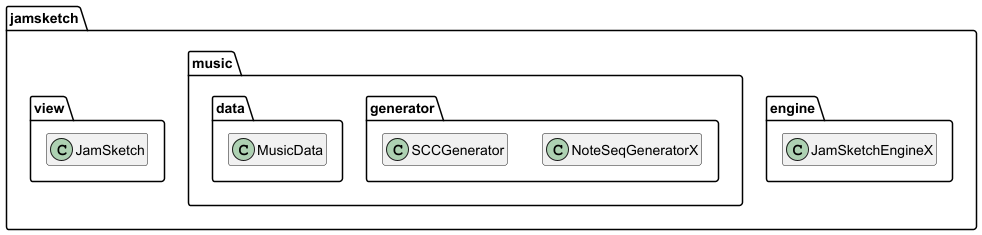
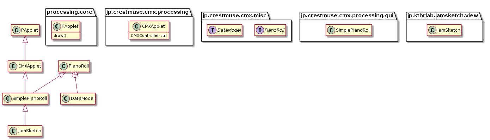
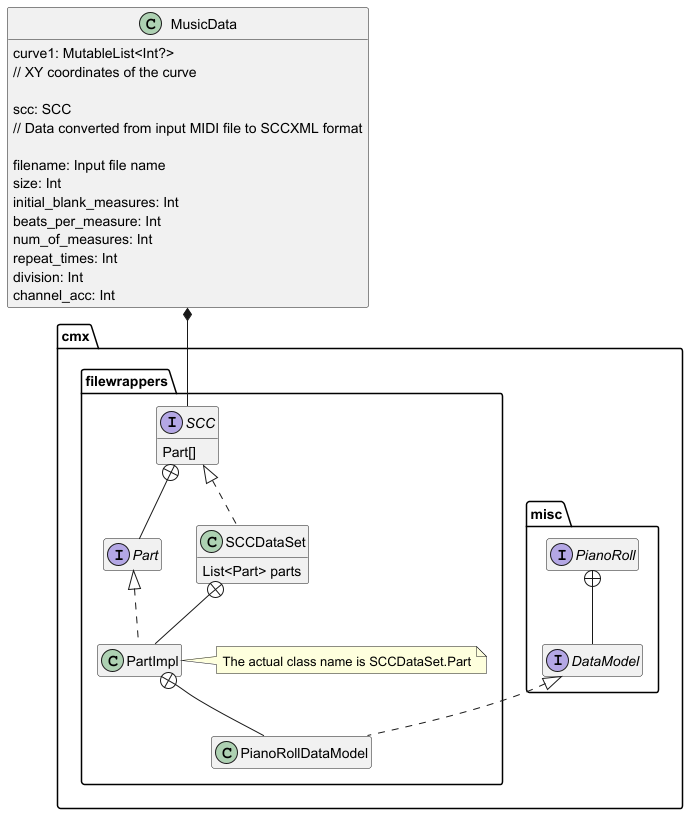
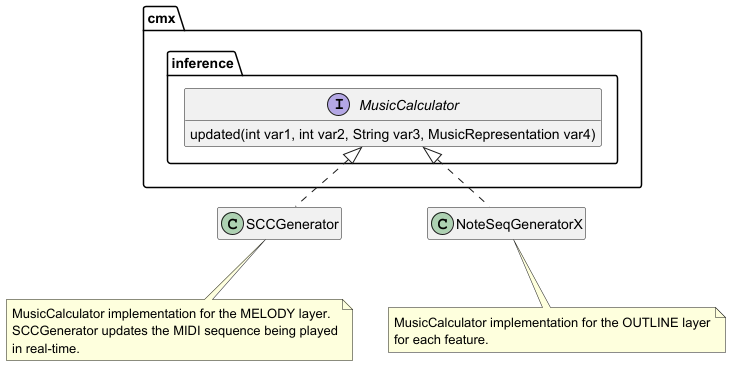

### Main Classes in JamSketch

#### JamSketch is an extension of the processing PApplet

#### MusicData
MusicData is JamSketch input and output data.

* curve1 

  curve1 holds the coordinates of the curve drawn by the user.

  * scc

    scc is generated by reading from a MIDI file. 
    It is both input and output data.
    JamSketch updates the generated performance in real-time while playing the scc.

#### MusicCalculators

In JamSketch, the MusicCalculators of each layer work together to perform the process.

##### NoteSeqGeneratorX

"X" is the name of the feature.
By separating the music generation for each feature, it can be implemented in a variety of ways.

##### SCCGenerator

A MusicCalculator to edit scc for the generated music.